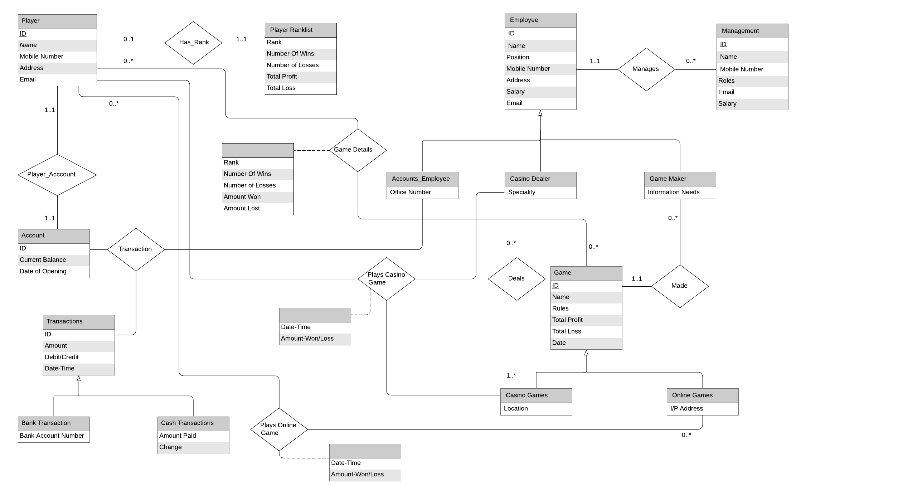

# theGambler

theGambler is a Database Management System that can be used by a casino. This DBMS shall have the capabilities to help its stakeholders like Players, Casino Management, Employee with the queries and requirements.

## Stakeholders And Their Queries

* Players: 
  * They are one of the primary users of this database. 
  * They will access it with the highest frequency of queries to track their winnings and decisions they made. 
  * The database will provide great insight to the players regarding their performance over various games. 
  * They can use this system for :
    * To view players currently ranked below or above him/her.
    * Check the total profits/loss from the games played at the casino.
    * Check the games they haven’t played.
    * Get their current balance.
    * Check total wins.

* Casino Management: 
  * The management is the main control board managing the database with all the admin rights. 
  * They will have exclusive access to information regarding various players and statistics of the games installed in their casino. 
  * The database will also help them keep track of their staff and financial expenditures. 
  * They can use this system for:
     * Add a newly hired employee
     * Update the salary of an employee
     * Get average salary till each employee (Windowing)
     * Get average salary for each component till each employee (Windowing)

## E-R Diagram for this DBMS

## Features Implemented 
* Login and Authentication Features :
  * The player has the option to create a new account or login using a previously existing account.
  * The casino management can only login using their credentials and not create a new account to avoid any chances of an intrusion.

* The casino management is provided with the options to :
  *  View details of all the players
  *  View details of all the employees
  *  Change the salary of an employee
  *  View Details of a player using their ID
  *  View Details of an employee using their ID
  *  Add a newly hired employee
  *  View the highest profit of a game by a game maker using its ID.

* The player is provided with the options to :
  *  View Details
  *  View total profit, total loss, and net profit/loss for each game played
  *  View the games not played by the user
  *  View current balance
  *  View the current Rank List of the players.

* The user is also provided an option to play some games. 
  *  Game: Unjumbled
    * The computer generates a random jumbled order of a word, and the player has to guess the original word. 
  * Game: GuessNumber
    * The computer generates a hidden random number between 0 to 31, and the player has to guess the number.
  * Rules :
    * The player can choose whether to bet on the fact whether they could correctly win the next round. 
    * If the player chooses to bid and wins the next round, they gain 100 points.
    * If the player chooses to bid and loses the next round, they lose 100 points.
    * If the player decides not to bid, the player loses 10 points irrespective of the fact whether or not they win the next round.
* To improve the user experience, feedbacks provided by other users are also displayed on the home page of the website.

* Security Features :
  * Only the admin can create new users with employee status. 
  * A backup of the entire database is created every 24 hours to avoid any loss of data.

## Repository Contents :
 * The repo contains web application code written in Django framework.
 * DataBackupScript/ contains the data backup script.
 * images/ contains a few images of the web application.
 * create_db.txt contains the create table commands for MySQL database.

## Technologies Used :
* Django
* Git
* Azure
* Python3
* HTML
* CSS 
* Lucid Chart
* MySQL

